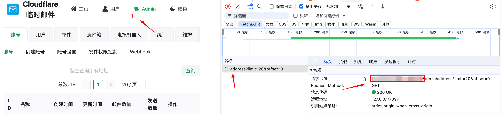
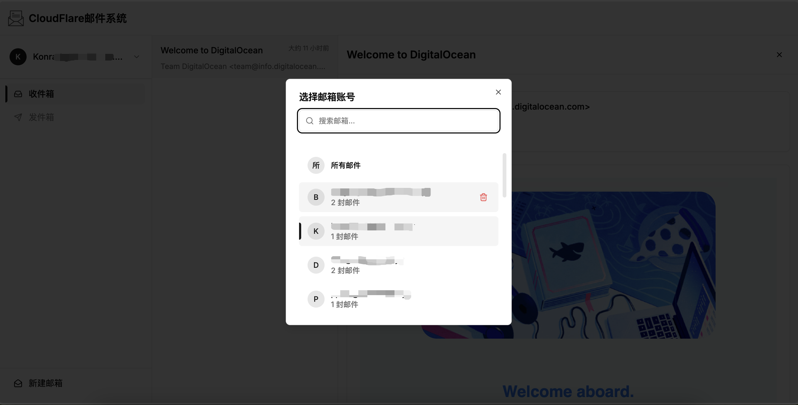
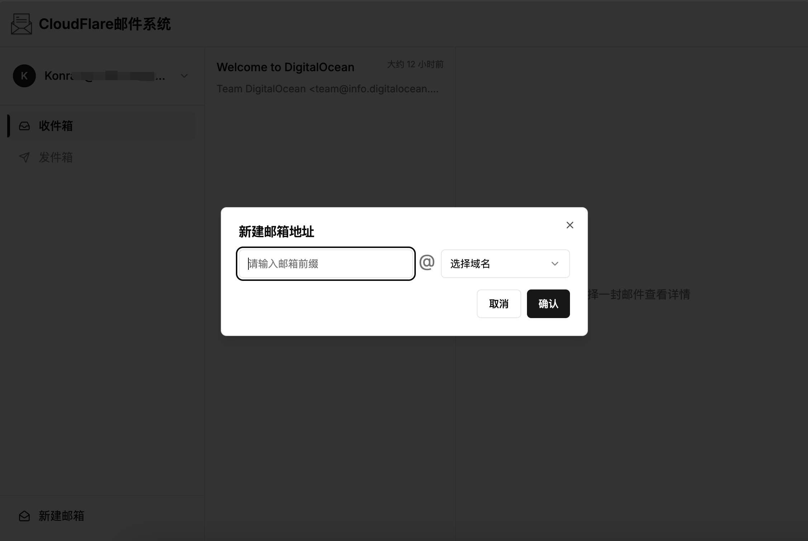
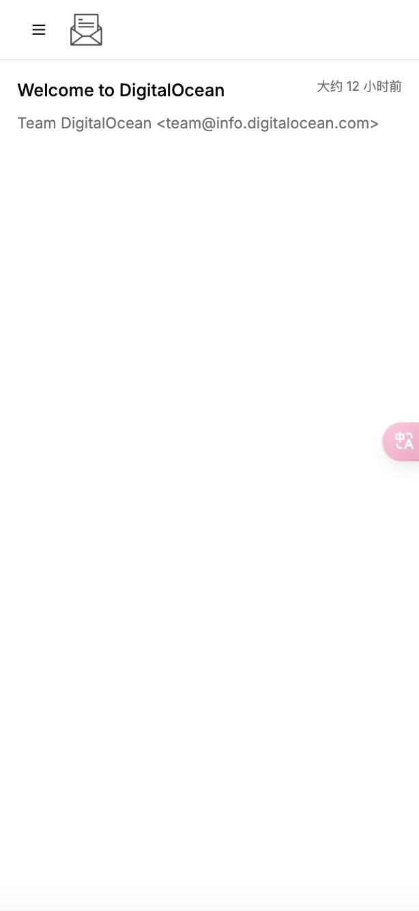
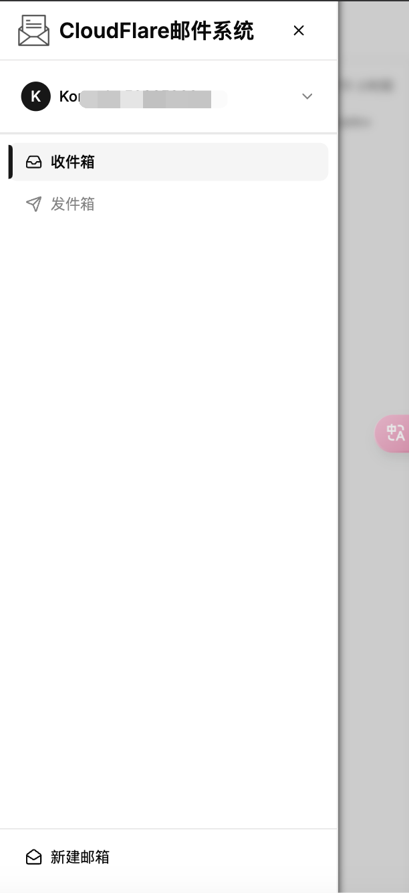

# Cloudflare邮箱管

之前使用了[cloudflare_temp_email](https://github.com/dreamhunter2333/cloudflare_temp_email)部署了一个cloudflare邮箱，但是前端管理页面不是特别符合我的使用习惯，尤其是移动端，邮件查看基本没法用。所以用cursor撸了一个适合自己使用习惯的前端页面出来。

## 预览

### PC端





### 移动端

<div style="display: flex; gap: 10px;">
  
  
</div>

## Vercel部署

[](https://vercel.com/new/clone?repository-url=https://github.com/jiangnan1224/cloudflare-mail)

## 特色功能

### 邮件管理
- 🔄 实时邮件接收（30秒自动刷新）
- 📍 新邮件红点提示
- 🔍 邮件内容预览
- 📎 附件查看和下载
- 💨 无限滚动加载更多邮件

### 用户体验
- 📱 响应式设计，支持移动端
- 👆 移动端支持滑动返回
- ⚡️ 快速切换邮箱账号
- 🔒 安全的 HTML 内容渲染

### 邮箱管理
- ✨ 快速创建新邮箱
- 🗑️ 删除确认保护
- 🔍 邮箱搜索功能

## 部署指南

### 环境要求
- Node.js 18+
- 支持 WebAssembly 的环境

### 环境变量
```bash
# API 基础地址
NEXT_PUBLIC_API_BASE_URL=your_api_base_url

# 认证密码
NEXT_PUBLIC_AUTH_PASSWORD=your_password
```

其中，`API基础地址`参考[Cloudflare Pages 前端](https://temp-mail-docs.awsl.uk/zh/guide/ui/pages.html)里面的`worker 域名为后端 api 的域名`
`认证密码`就是[cloudflare_temp_email后端配置文件](https://temp-mail-docs.awsl.uk/zh/guide/cli/worker.html#%E4%BF%AE%E6%94%B9-wrangler-toml-%E9%85%8D%E7%BD%AE%E6%96%87%E4%BB%B6)里面的ADMIN_PASSWORDS

### 本地开发

```bash
# 安装依赖
pnpm install

# 开发环境运行
pnpm dev

# 生产环境构建
pnpm build
pnpm start
```

### Vercel 部署

点击上方的 "Deploy with Vercel" 按钮，然后：

1. 连接你的 GitHub 仓库
2. 配置环境变量
3. 部署完成后即可访问

## 技术栈

- Next.js 14
- TypeScript
- Tailwind CSS
- Framer Motion
- SWR
- Zustand
- shadcn/ui

## 开源协议

MIT License
